# FPGA 기반 에어드로잉 (Air Drawing)

OV7670 카메라 영상에서 **초록 마커를 검출해 궤적을 그리는 전 과정을 FPGA RTL로 구현**하고,
**VGA로 출력한 화면을 캡처카드로 되받아 PC 오버레이 UI와 UART로 양방향 연동**한 시스템입니다.
영상 버퍼는 **전체 프레임버퍼 안과 64라인 링버퍼 안 두 가지를 구현해 비교**한 뒤 프레임버퍼 안을 최종 채택했고,
9개 RTL 모듈에 대해 **UVM 검증 환경을 구축**했습니다.

색 검출, 중심점 추출, 좌표 필터링, 선 보간, 브러시 렌더링은 전부 FPGA 안에서 처리하며 PC는 표시와 조작만 담당합니다.

| 항목 | 내용 |
|---|---|
| 수행 기간 | 2026.07 (7.9 ~ 7.21) |
| 담당 역할 | PC 오버레이 UI 설계, UART RX 경로 및 펜 상태 제어 RTL (`uart_packet_decoder`, `pen_config_controller`, `button_debounce`) |
| 사용 언어 | SystemVerilog, Python |
| 사용 기술 | VGA Timing, SCCB, Frame Buffer, CDC, UART, UVM, Functional Coverage |
| 사용 툴 | Vivado 2020.2, VCS 2024.09-SP1, UVM 1.2 |
| 검증 보드 | AMD Basys3 (Artix-7 XC7A35T), OV7670, Fw171 VGA 캡처 보드 |

**구현 결과 요약**

| 항목 | 결과 |
|---|---|
| 영상 | 320×240 RGB565 프레임버퍼 + 320×240×4bit 캔버스 |
| 리소스 | LUT 5.09% / FF 2.20% / **BRAM 96.00%** / DSP 4.44% |
| 타이밍 | `All user specified timing constraints are met.` |
| UVM 검증 | 9개 모듈 0 FAIL, 기능 커버리지 **100%** |

---

## 1. 프로젝트 개요

FPGA는 카메라에서 들어오는 픽셀, 사용자가 그리는 선, VGA 출력이라는 서로 다른 속도의 흐름을 동시에 다룹니다.
카메라 영상은 **프레임버퍼**에, 그린 선은 **별도 캔버스 버퍼**에 나눠 담고 출력 시점에 합성하는 구조로 설계했습니다.

<p align="center">
  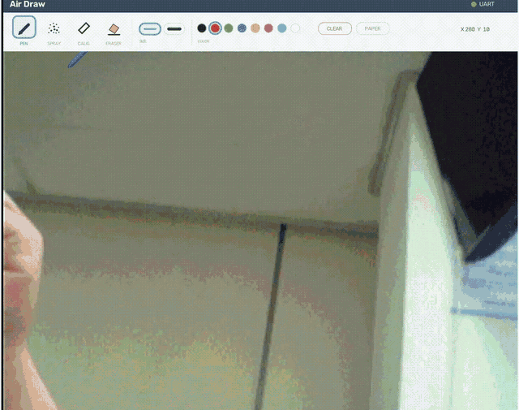
</p>

- 입력: 초록 마커 (OV7670), 보드 푸시버튼 4개, PC 툴바
- 출력: VGA 모니터, PC 오버레이 UI

| 기능 | 내용 |
|---|---|
| 펜 모양 | 볼펜 / 스프레이 / 캘리그래피 / 지우개 |
| 펜 굵기 | 2단계 |
| 펜 색상 | 8색 (RGB 3비트) |
| 도화지 모드 | 카메라 배경 ↔ 흰 배경 전환 |
| 캡처 모드 | 배경을 정지시킨 뒤에도 그 위에 계속 드로잉 |
| 갤러리 | 현재 화면을 PNG로 저장 |
| 이중 입력 | 펜 모드·굵기·지우개·지우기를 보드 버튼과 PC UI에서 동시 조작 |

---

## 2. 저장소 구조

```
.
├── v1-framebuffer/                  # 채택안 — 320×240 프레임버퍼
│   ├── README_KR.md
│   ├── python_ui/  air_draw_ui.py, assets/
│   ├── uvm/                         # UVM 검증 환경 (9개 모듈)
│   └── vga_uart_project/
│       ├── vga_uart_project.srcs/sources_1/    # SystemVerilog RTL
│       ├── vga_uart_project.srcs/constrs_1/    # Basys-3-Master.xdc
│       └── vga_uart_project.runs/impl_1/       # bitstream, 리포트
│
├── v2-line-header/                  # 대안 — 64라인 링버퍼 + 전송 헤더
│   ├── README.md
│   ├── python_ui/
│   ├── vga_uart_project/
│   └── visualization/
│
└── docs/images/
```

| 계층 | 모듈 |
|---|---|
| top | `top_airDrawing` |
| 클록 · 타이밍 | `clock_gen`, `vga_decoder`, `hv_counter`, `timing_decoder` |
| 카메라 | `top_ov7670`, `ov7670_sccb_ctrl`, `ov7670_memcontroller`, `i2c_master`, `ov7670_pkg` |
| 버퍼 | `top_buffer`, `top_framebuffer`, `framebuffer`, `framebuffer_reader`, `overlay_pixel_mux` |
| 드로잉 | `top_canvas`, `canvas_buffer_top`, `colour_detector`, `bbox_center_accum`, `coord_filter`, `brush_draw_engine`, `brush_stroke_controller`, `bresenham_interpolator`, `circular_brush_renderer`, `canvas_buffer` |
| 통신 | `uart_rx`, `uart_tx`, `uart_packet_decoder`, `uart_packet_sender`, `baud_tick_16oversample` |
| 입력 | `button_debounce`, `pen_config_controller` |

---

## 3. FPGA 설계

### 3.1 `top_airDrawing` 구성

<p align="center">
  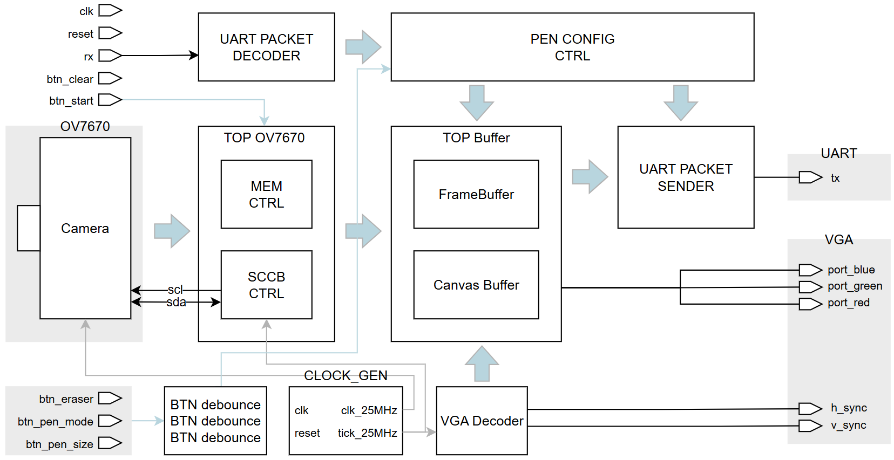
</p>

`top_airDrawing`은 직접 픽셀을 계산하지 않고 아래 모듈을 연결합니다.

| 모듈 | 역할 |
|---|---|
| `clock_gen` | 100 MHz에서 VGA용 `tick_25`와 카메라 XCLK `clk_25` 생성 |
| `vga_decoder` | 800×521 스캔 좌표, HSYNC·VSYNC·display enable |
| `top_ov7670` | SCCB 초기화 + RGB565 픽셀 조립 |
| `top_buffer` | 프레임버퍼 · 캔버스 · 출력 합성 |
| `pen_config_controller` | 물리 버튼과 PC 명령을 하나의 펜 상태로 통합 |
| `uart_packet_decoder` / `sender` | PC ↔ FPGA 양방향 패킷 |

`clock_gen`은 MMCM 없이 100 MHz를 4분주해 사용합니다. `tick_25`는 4클록마다 1이 되는 clock enable로
VGA 카운터를 실효 25 MHz로 진행시키고, `clk_25`는 50% 듀티 출력으로 OV7670 XCLK에 공급합니다.
구현 리포트에서도 MMCM 사용량은 0입니다.

VGA는 blanking을 포함해 한 프레임이 800×521이므로 주사율은 `25 MHz ÷ (800 × 521) = 59.98 Hz`입니다.

### 3.2 카메라 인터페이스

<p align="center">
  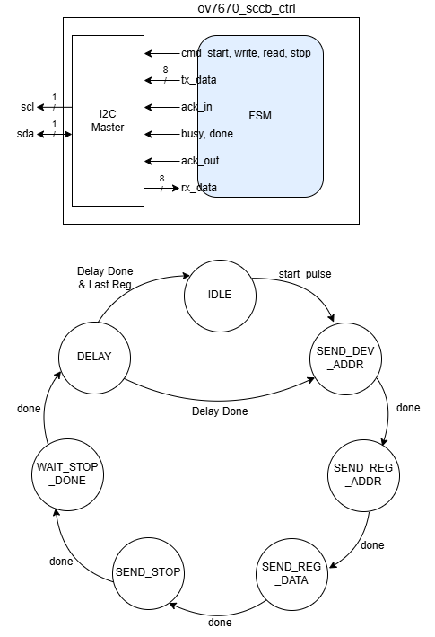
</p>

`ov7670_sccb_ctrl`은 `ov7670_pkg.sv`의 레지스터 설정을 SCCB로 순차 전송하는 상태기계입니다.
XCLK 안정까지 약 30 ms 대기 후 COM7 software reset부터 시작하고, 레지스터 사이에 약 1 ms 간격을 둡니다.
내부에서 `i2c_master`를 구동해 `scl` · `sda` 파형을 만듭니다.

`ov7670_memcontroller`는 8비트 DVP 버스의 연속된 두 바이트를 RGB565 한 픽셀로 조립하고,
VSYNC·HREF로 프레임 시작에서 주소와 바이트 위상을 함께 0으로 정렬합니다.

### 3.3 프레임버퍼와 캔버스 합성

`top_buffer`는 세 부분으로 나뉩니다.

| 모듈 | 내용 |
|---|---|
| `top_framebuffer` | `framebuffer` (320×240 × 16bit RGB565) + `framebuffer_reader` |
| `top_canvas` | `canvas_buffer_top` — 마커 검출부터 캔버스 저장까지 |
| `overlay_pixel_mux` | `canvas_valid`면 캔버스 색, 아니면 카메라 픽셀 |

```systemverilog
// overlay_pixel_mux.sv
assign o_display_pixel = i_canvas_valid ? i_canvas_pixel : i_frame_pixel;
```

`framebuffer_reader`는 화면 좌표가 `x < 320 && y < 240`인 영역에만 프레임버퍼를 읽어 붙이고,
RGB565에서 각 채널 상위 4비트를 뽑아 VGA의 RGB444 포트로 내보냅니다.
Basys3의 VGA 출력이 저항 DAC라 채널당 4비트가 한계이므로 표시 품질 손실은 없습니다.

메모리는 프레임버퍼 150 KiB + 캔버스 37.5 KiB로, XC7A35T의 BRAM을 96% 사용합니다.

**도화지 모드와 캡처 모드**도 이 지점에서 처리합니다. 둘 다 추가 BRAM 없이 구현했습니다.

```systemverilog
// 도화지: 배경만 흰색으로 교체
assign background_pixel = i_paper ? 16'hFFFF : frame_pixel;

// 캡처: 배경 프레임버퍼 쓰기만 정지 (그리기 경로는 그대로)
.i_write_enable(i_write_enable & ~freeze_sync)
```

캡처를 PC에서 화면을 얼리는 방식으로 구현하면 그림이 FPGA에서 합성되어 오기 때문에 새로 그리는 선까지 멈춥니다.
그래서 FPGA에서 배경 쓰기만 게이팅했습니다. `i_freeze`는 100 MHz 도메인 신호라 쓰기 클럭(pclk)으로 2FF 동기화한 뒤 사용합니다.
색 검출 경로는 write-side 데이터를 그대로 보므로 도화지 모드에서도 마커 추적이 정상 동작합니다.

### 3.4 UART 패킷과 상태 소유

영상은 VGA 경로로, 펜 좌표와 도구 설정은 UART 경로로 분리해 보냅니다. (115200 baud, 8N1)

```
FPGA → PC (6B, 프레임당 1회)
[0] 0xAA   start
[1] X_center[8:1]
[2] Y_center[7:0]
[3] control
[4] texture_shape
[5] 0x55   end

PC → FPGA (4B, 설정 변경 시)
[0] 0xA5   [1] control   [2] shape   [3] 0x5A

control : bit7 texture / bit6 eraser / bit5 size
          bit4 R / bit3 G / bit2 B / bit1 clear / bit0 reserved
shape   : bit2:0 texture_shape / bit3 paper / bit4 freeze
```

6바이트 전송에 약 0.521 ms가 걸려 30 fps 기준 프레임 시간 33.33 ms 안에 충분히 들어갑니다.

**RX 디코더** — `uart_packet_decoder`는 송신부와 대칭이 되도록 내부에 `baud_tick_16`과 `uart_rx`를 함께 두어,
상위 모듈에서는 `rx` 한 선만 연결하면 되게 했습니다.

```
WAIT_START (0xA5) → WAIT_CONTROL → WAIT_SHAPE → WAIT_END (0x5A)
```

end 바이트가 맞을 때만 출력을 갱신하므로 깨진 패킷이 설정을 건드리지 않습니다.
바이트 간격이 `TIMEOUT_TICKS = 480`(3바이트 시간)을 넘으면 프레이밍이 어긋난 것으로 보고 `WAIT_START`로 복귀해 재동기화합니다.

**상태 소유** — 물리 버튼과 PC UI가 같은 설정을 동시에 바꿀 수 있어, **최종 상태는 `pen_config_controller` 하나만 소유**하도록 설계했습니다.

| 항목 | 처리 |
|---|---|
| 갱신 규칙 | last-write-wins, 같은 클록에 겹치면 버튼 우선 |
| 버튼 입력 | `button_debounce`가 2FF 동기화 후 10 ms 안정 시 1클록 펄스 생성 |
| `clear` | 1클록 이벤트를 pclk 도메인이 놓치지 않도록 `CLEAR_STRETCH = 256` 클록으로 확장 |
| 초기값 | `pen_color = 3'b100` (빨강), 얇은 굵기 |

TX 패킷은 스위치 원본이 아니라 이 모듈의 **실효 상태**를 실어 보냅니다.
그래서 보드에서 바꾸든 UI에서 바꾸든 양쪽 표시가 항상 일치합니다.

---

## 4. 마커 추적 및 드로잉 파이프라인

<p align="center">
  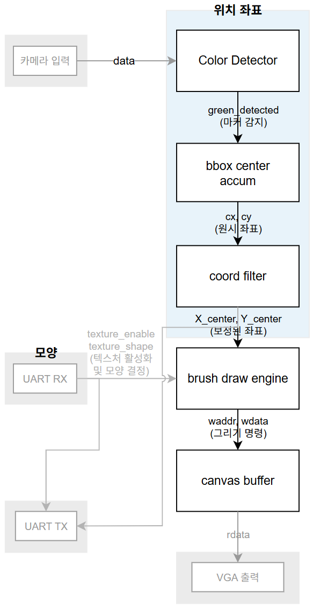
</p>

`canvas_buffer_top`이 카메라 배경과 그림을 분리해, 그린 선을 프레임버퍼가 아닌 별도 캔버스에 저장합니다.

### 4.1 노이즈 제거 & 중심점 추출

<p align="center">
  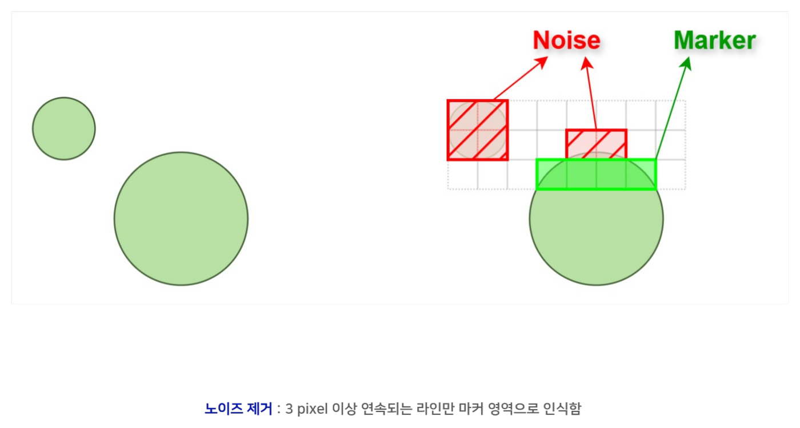
</p>

`colour_detector`는 HSV 변환 없이 **RGB 채널 우세 비교**로 마커를 찾습니다. 나눗셈을 쓰지 않기 위한 선택입니다.

```systemverilog
// colour_detector.sv — 6bit 기준
(g_6bit >= 6'd36) && (g_6bit - r_6bit >= 6'd16) && (g_6bit - b_6bit >= 6'd16)
```

조명 변화와 압축 때문에 초록으로 오판되는 점 노이즈가 생기므로,
**가로로 3픽셀 이상 연속되는 구간만** 마커 영역으로 인정해 걸러냅니다.

<p align="center">
  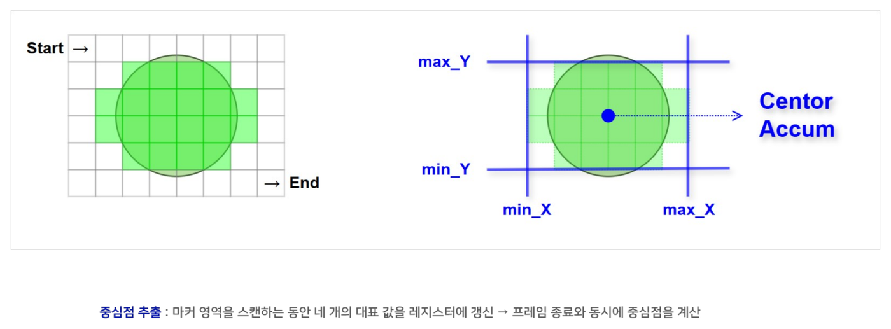
</p>

`bbox_center_accum`은 프레임을 스캔하는 동안 `min_X` · `max_X` · `min_Y` · `max_Y` 네 레지스터만 갱신하고,
프레임 종료와 동시에 중심점을 확정합니다. 프레임을 저장하지 않고 1패스로 좌표를 얻는 구조입니다.

### 4.2 떨림 보정 — `coord_filter`

<p align="center">
  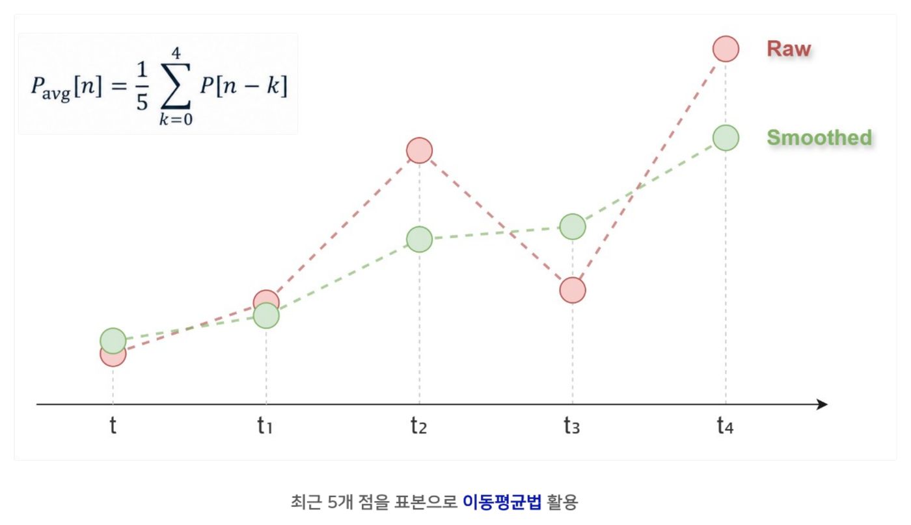
</p>

최근 5개 좌표의 이동평균을 사용합니다.
탭 수를 늘리면 선은 부드러워지지만 좌표 지연이 커지므로 5로 고정했습니다.

### 4.3 브러시 그리기 — `brush_draw_engine`

<p align="center">
  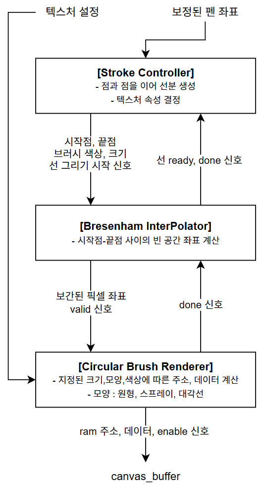
</p>

세 모듈이 ready · done 핸드셰이크로 직렬 연결됩니다.

| 모듈 | 역할 |
|---|---|
| `brush_stroke_controller` | 이전 점과 현재 점을 이어 선분 생성, 색·크기·텍스처 속성 결정 |
| `bresenham_interpolator` | 시작점과 끝점 사이의 빈 좌표 계산 |
| `circular_brush_renderer` | 각 좌표에 브러시를 찍어 `canvas_buffer`의 주소·데이터 생성 |

마커가 빠르게 움직이면 프레임 간 좌표가 벌어져 선이 점선처럼 끊깁니다.
Bresenham's line은 곱셈기나 나눗셈 없이 오차항 누적만으로 두 점 사이를 채워 하드웨어에 적합합니다.

<details>
<summary><b>오차항 누적 동작</b></summary>

<p align="center">
  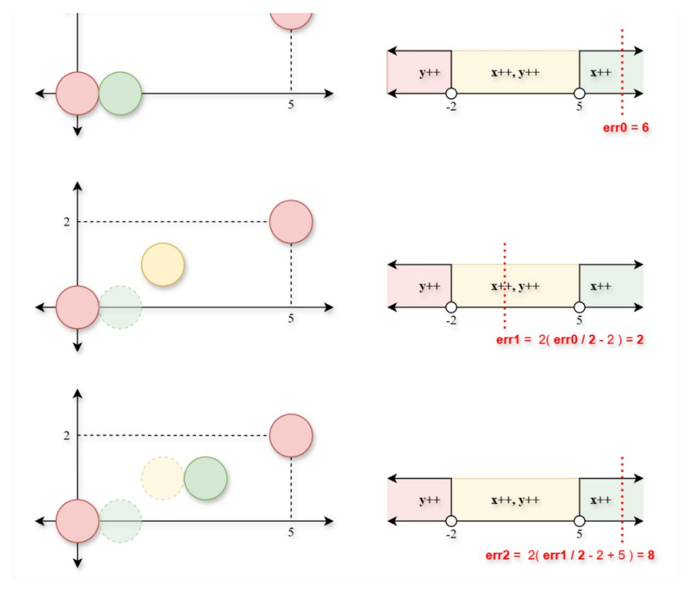
</p>

</details>

<p align="center">
  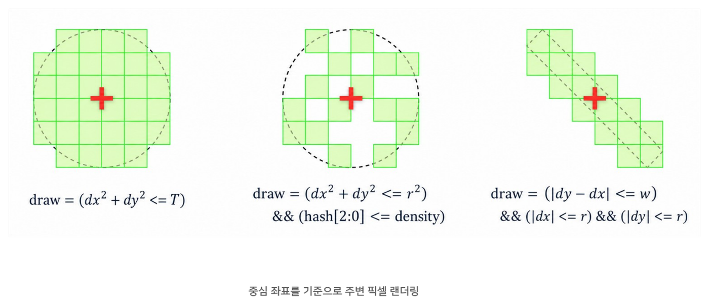
</p>

브러시는 중심 좌표 기준 주변 픽셀 판정식을 바꿔 종류를 구현했습니다.

| 펜 | 판정식 |
|---|---|
| 볼펜 | `dx² + dy² <= T` |
| 스프레이 | `dx² + dy² <= r²` && `hash[2:0] <= density` |
| 캘리그래피 | `\|dy − dx\| <= w` && `\|dx\| <= r` && `\|dy\| <= r` |

결과는 `canvas_buffer`에 `{valid, R, G, B}` 4비트로 저장합니다. 색이 있는지와 1비트 RGB만 담는 구조입니다.

### 4.4 단계별 적용 결과

| 원본 | 노이즈 제거 · 중심점 · 브러시 | 떨림 보정 · 끊김 보정 추가 |
|:---:|:---:|:---:|
| 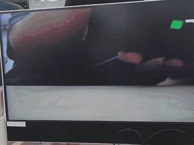 | 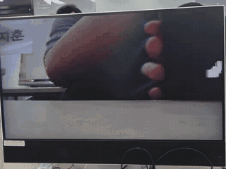 | 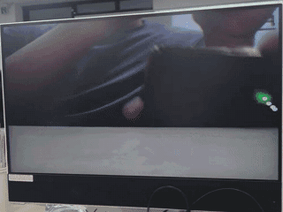 |

---

## 5. PC 오버레이 UI

`air_draw_ui.py`가 캡처카드 영상 위에 툴바를 그리고, 조작 결과를 UART로 FPGA에 전달합니다.

| 기능 | 동작 |
|---|---|
| 툴바 | 펜 4종 · 굵기 2단계 · 색 8종 · CLEAR · PAPER를 클릭으로 전환, 4바이트 패킷 전송 |
| 상태 표시 | FPGA가 보낸 TX 패킷을 반영하므로 보드 스위치로 바꿔도 UI가 따라감 |
| 마커 아이콘 | 현재 펜 종류와 좌표를 화면에 표시 (저장 파일에는 미포함) |
| 갤러리 | 현재 화면을 `python_ui/captures/airdraw_날짜_시각.png`로 저장 |
| UART 상태 | 포트 연결 여부를 상단에 표시 |

캡처카드가 넘겨준 640×480 화면에서 검은 테두리를 자동 감지해 유효 영역만 잘라 쓰고,
좌측 경계에 남는 컬럼은 고정 크롭으로 제거합니다.

---

## 6. 구현 결과

`v1-framebuffer` implementation 기준입니다.

| 리소스 | 사용 | 가용 | 사용률 |
|---|---|---|---|
| Slice LUTs | 1,058 | 20,800 | 5.09% |
| Slice Registers | 916 | 41,600 | 2.20% |
| Block RAM Tile | 48 | 50 | **96.00%** |
| DSPs | 4 | 90 | 4.44% |
| Bonded IOB | 36 | 106 | 33.96% |
| MMCME2_ADV | 0 | 5 | 0.00% |

```
All user specified timing constraints are met.
```

> 원본 리포트: [`vga_uart_project.runs/impl_1/`](v1-framebuffer/vga_uart_project/vga_uart_project.runs/impl_1)

---

## 7. UVM 검증

VCS + UVM 1.2로 9개 모듈을 개별 검증했습니다. **0 FAIL, 기능 커버리지 100%.**
검증 환경은 [`v1-framebuffer/uvm/`](v1-framebuffer/uvm)에 있습니다.

| 모듈 | 확인 대상 | 테스트 |
|---|---|---|
| `ov7670_memcontroller` | 픽셀 데이터를 유실 없이 읽고 쓰는가 | 랜덤 픽셀, cycle 단위 write 이벤트 비교 |
| `uart_packet_decoder` | Start/End bit 인식, 비정상 패킷 제거 | 랜덤 패킷 |
| `uart_packet_sender` | 펜 상태를 패킷으로 정확히 생성·출력 | 랜덤 패킷 |
| `pen_config_controller` | 버튼·스위치와 PC 명령을 모두 반영 | 랜덤 UART, 랜덤 버튼 |
| `bbox_center_accum` | 노이즈 제거 후 중심점 정확도 | random · coverage · stress |
| `coord_filter` | 연속 좌표의 떨림 보정 | basic · jitter · spike · random |
| `brush_stroke_controller` | 연속 좌표에서 올바른 드로잉 데이터 생성 | basic · connect · penup · eraser · size · random · stress |
| `bresenham_interpolator` | 직선 보간이 의도대로 수행되는가 | random · boundary · regression |
| `circular_brush_renderer` | 중심 좌표 기준 브러시 표현 | random · boundary · texture · stress |

<p align="center">
  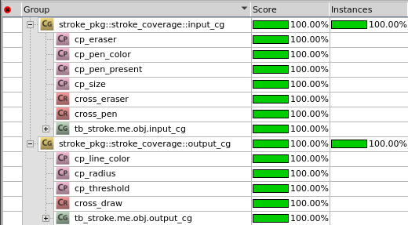
</p>

**도달 불가능한 조합 제외** — 커버리지가 100%에 도달하지 못한 원인을 추적한 결과,
하드웨어 구조상 발생할 수 없는 cross bin이 분모에 포함되어 있었습니다.
`sw_eraser = 1`이면 `line_radius`는 5 또는 7만 나오므로 `지우개 색 × 반경(2, 3)` 조합은 존재할 수 없습니다.
이런 조합을 `ignore_bins`로 제외해 도달 가능한 조합만 계산하도록 했습니다.

```systemverilog
// stroke_coverage.sv
ignore_bins eraser_with_low_mid          = binsof(cp_line_color.color_eraser) && ...
ignore_bins draw_colors_with_erase_radius = (binsof(cp_line_color.black) || ...
```

**랜덤이 닿지 않는 구간 보완** — `bresenham_interpolator`는 랜덤만으로는
음수 방향(`h_neg`, `v_neg`)과 수직·대각선 bin이 채워지지 않았습니다.
비율 제약으로 해당 선 종류를 유도하고, 경계 테스트(화면 4개 모서리, 축 정렬 선, zero-length 선)를 더해
`boundary 13 + random 1,000` 리그레션으로 100%를 달성했습니다.

---

## 8. 대안 설계 — 64라인 링버퍼

BRAM을 96% 쓰고 있어 해상도를 더 올릴 수 없다는 점에서 출발한 두 번째 안입니다.
동작하는 완성 설계이며 [`v2-line-header/`](v2-line-header)에 전체 구현과 문서가 있습니다.
두 안을 비교한 결과 **프레임버퍼 안을 최종 채택**했고, 그 근거는 아래 비교표에 정리했습니다.

**FPGA는 흘러가는 64라인만 유지하고, 완성 프레임 조립을 PC가 담당**하도록 역할을 옮겼습니다.

<p align="center">
  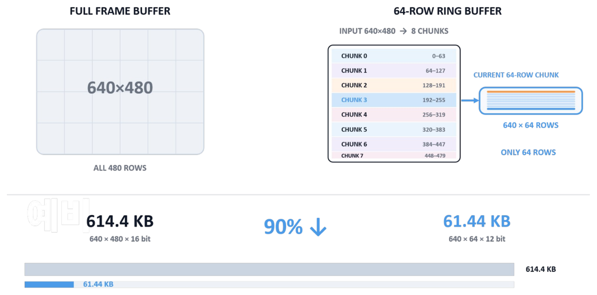
</p>

PC가 각 라인의 원래 위치를 알아야 하는데 VGA 화면 위치는 캡처카드 재동기화 한 번이면 어긋납니다.
각 라인 오른쪽 끝 21픽셀을 흑백 비트로 써서 **주소를 영상 자체에 실어 보냈습니다.**

<p align="center">
  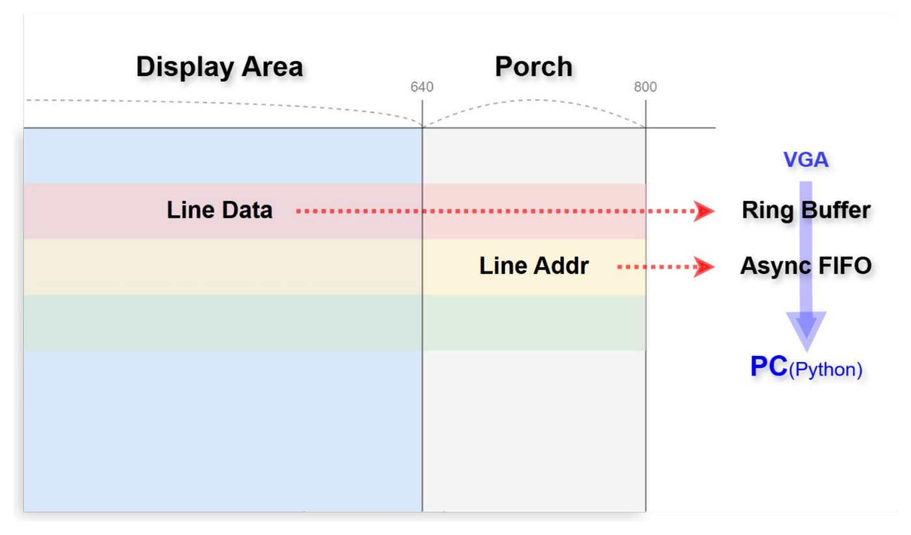
</p>

```
bit 0..2    시작 패턴 101
bit 3       line valid
bit 4..7    frame ID 하위 4비트
bit 8..16   원래 카메라 source y (9비트)
bit 17..20  frame ID + source y 기반 4비트 checksum
```

<p align="center">
  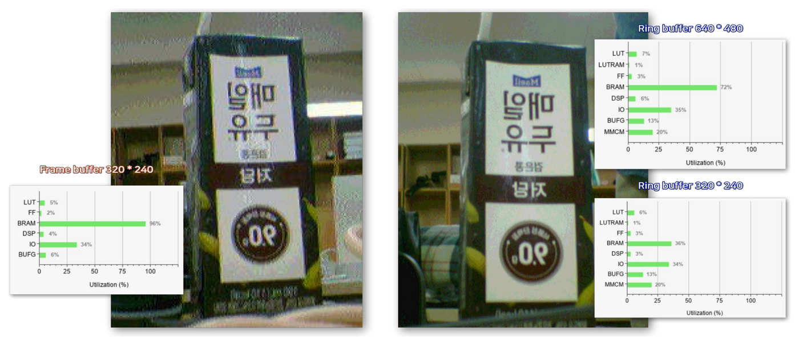
</p>

| 항목 | 채택안 — 프레임버퍼 | 대안 — 64라인 링버퍼 |
|---|---|---|
| 영상 해상도 | 320×240 | 640×480 |
| 640×480 기준 영상 버퍼 | 614.4 KB (RGB565) | 61.44 KB (RGB444) |
| BRAM 사용률 | 96% (320×240 조건) | 72% (640×480 조건) |
| 프레임 완성 주체 | FPGA | PC |
| PC 없이 동작 | 가능 (VGA 모니터만으로 완결) | 불가 (완전한 프레임이 FPGA에 없음) |
| 추가 요구 사항 | – | 캡처카드 프레임 무결성, PC 재조립 연산 |

링버퍼 안이 해상도를 4배로 올리면서도 BRAM을 덜 쓰는 것은
**FPGA가 하던 프레임 보관을 PC가 대신 맡았기 때문**이며, 그만큼 시스템 경계가 PC 쪽으로 넘어갑니다.
보드 단독으로 영상 경로가 완결되는 쪽을 우선해 프레임버퍼 안을 최종 채택했습니다.

링버퍼 안을 검증하는 과정에서는 밝은 장면에 보라색·노란색 결점이 나타나는 문제가 있었습니다.
전송 자체는 정상이라, PCLK가 높을수록 D[7:0] 8선과 HREF·VSYNC가 같은 경계에서 setup·hold를 만족하지 못하는 것이 원인이었습니다.
카메라 신호를 IOB 입력 레지스터에 먼저 등록하고 `CLKRC`로 PCLK를 낮춰 해결했습니다.

<p align="center">
  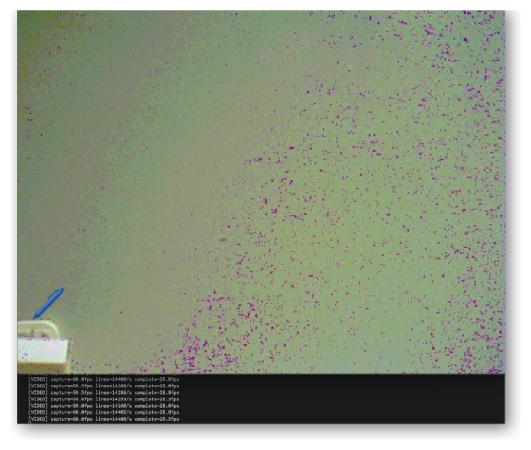
</p>

---

## 9. 실행 방법

### 연결

OV7670 → Basys3 PMOD ([`Basys-3-Master.xdc`](v1-framebuffer/vga_uart_project/vga_uart_project.srcs/constrs_1/Basys-3-Master.xdc))
Basys3 VGA → 캡처카드 → PC USB · Basys3 USB-UART → PC USB

### FPGA

```tcl
open_project v1-framebuffer/vga_uart_project/vga_uart_project.xpr
launch_runs impl_1 -to_step write_bitstream
```

생성본을 바로 쓰려면 [`top_airDrawing.bit`](v1-framebuffer/vga_uart_project/vga_uart_project.runs/impl_1/top_airDrawing.bit)를 프로그래밍합니다.

### PC UI

```powershell
cd v1-framebuffer\python_ui
python -m venv .venv
.\.venv\Scripts\pip.exe install opencv-python numpy pyserial
.\.venv\Scripts\python.exe .\air_draw_ui.py
```

COM 포트는 파일 상단 `COM_PORT`에서 지정하고, `None`으로 두면 자동 탐색합니다.

### 보드 조작

슬라이드 스위치는 리셋 하나만 쓰고, 펜 설정은 버튼과 PC UI 두 경로로 제어합니다.

| 물리 입력 | 핀 | 신호 | 동작 |
|---|---|---|---|
| SW15 | R2 | `reset` | 시스템 리셋 |
| BTN_C | U18 | `start_btn` | 카메라 시작 |
| BTN_U | T18 | `btn_pen_mode` | 펜 모드 순환 (펜 → 스프레이 → 캘리그래피) |
| BTN_D | U17 | `btn_pen_size` | 굵기 토글 |
| BTN_L | W19 | `btn_eraser` | 지우개 토글 |
| BTN_R | T17 | `clear_btn` | 화면 지우기 |

색상 8종과 도화지·캡처 모드는 버튼이 없어 PC UI 전용입니다.

---

## 10. 문제 해결

### 물리 버튼과 GUI가 서로 상태를 덮어쓰는 문제

보드 스위치로 색을 바꾸면 UI 표시가 따라오지 않고, UI에서 바꾸면 다음 버튼 입력에 되돌아가는 현상이 있었습니다.
상태를 양쪽이 각자 들고 있었기 때문입니다.
`pen_config_controller`를 상태의 단일 소유자로 두고, FPGA가 TX 패킷으로 실제 상태를 에코하도록 바꿔
UI가 자기 값을 신뢰하지 않고 수신 값으로 표시하게 했습니다.

### 캡처 영상의 좌측 검은 줄과 화면 깨짐

캡처카드가 넘겨준 프레임의 유효 영역을 고정 크롭으로 잘랐더니 환경에 따라 어긋났고,
자동 감지로 바꾸자 이번에는 노이즈 픽셀을 콘텐츠로 오탐했습니다.
**한 줄에 밝은 픽셀이 16개 이상일 때만** 콘텐츠로 인정하고 여러 프레임의 중앙값을 쓰도록 해서 안정화했습니다.
자동 감지로 잡히지 않는 좌측 컬럼은 고정 크롭(`CROP_LEFT = 12`)으로 함께 제거합니다.

### 커버리지가 100%에 도달하지 못하는 문제

`brush_stroke_controller`에서 테스트를 아무리 늘려도 cross bin 일부가 계속 0 hit으로 남아
전체 커버리지가 100%에 못 미쳤습니다.

원인은 테스트가 부족해서가 아니라 **해당 조합이 하드웨어에서 발생할 수 없는 것**이었습니다.
`sw_eraser = 1`이면 `line_radius`는 5 또는 7만 나오므로 `지우개 색 × 반경(2, 3)` 같은 조합은
아무리 랜덤을 돌려도 나올 수 없는데, 커버리지 분모에는 계속 포함되어 있었습니다.

이런 조합을 `ignore_bins`로 분모에서 제외해 **실제로 도달 가능한 조합 기준으로 100%**를 달성했습니다.

---

## 11. 팀 구성

| 이름 | 역할 |
|---|---|
| 엄태혁 | 컨트롤 유닛, 발표 자료 |
| 김민수 | 무게중심 · 필터 설계 |
| 나연우 | 컨트롤 유닛, 메모리 개선 |
| 장현동 | UVM 검증 |
| 조승아 | UVM 검증 |
| 조유정 | PC 오버레이 UI, UART RX 디코더 · 펜 상태 제어 RTL |
| 하지훈 | 버퍼 설계 |
